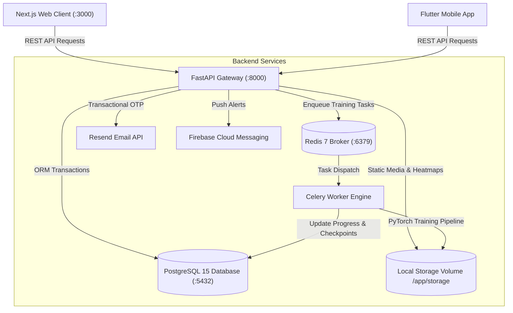

# AgroSentry AI Backend Discovery & Architecture Inventory Report

**Assessment Date:** August 5, 2026  
**Auditor / Assessor:** Senior Application Security & DevSecOps Lead  
**Target Application:** AgroSentry AI Backend  
**Repository:** `SharanMahiReddy6/AgroSentry-AI`  
**Classification:** Academic & Enterprise Security Assessment  

---

## 1. Technology Stack & Runtime Environment

| Category | Detected Component | Version / Specification | Details & Purpose |
|---|---|---|---|
| **Programming Language** | Python | `3.10+` / `3.11` | Primary backend language for API, ML inference, and worker pipelines |
| **Framework** | FastAPI | `0.104.1` | High-performance asynchronous REST API framework built on Starlette and Pydantic |
| **ASGI Server** | Uvicorn | `0.24.0.post1` | Lightning-fast ASGI web server implementation |
| **Package Manager** | pip / requirements.txt | Python standard | Dependency management (`backend/requirements.txt`) |
| **Task Queue / Worker** | Celery | `5.3.6` | Distributed asynchronous task queue for multi-epoch PyTorch training jobs |
| **Message Broker / Cache** | Redis | `7-alpine` (`redis:5.0.1` client) | In-memory key-value cache and Celery task broker |
| **Relational Database** | PostgreSQL | `15-alpine` | Primary persistent transactional relational database |
| **ORM / Database Engine** | SQLAlchemy | `2.0.23` | Declarative relational ORM with `SessionLocal` thread-local sessions |
| **DB Driver** | psycopg2-binary | `2.9.9` | Low-level C-extension PostgreSQL adapter for Python |
| **Machine Learning** | PyTorch / Torchvision | `torch>=2.0.0`, `torchvision` | Deep learning ResNet-18 model architecture & Grad-CAM visual heatmaps |
| **Computer Vision** | OpenCV Headless / PIL | `opencv-python-headless`, `pillow==10.1.0` | Leaf HSV color thresholding, contour extraction, spotlighting, and image preprocessing |
| **Authentication Engine** | Python-Jose & Passlib | `python-jose==3.3.0`, `passlib[bcrypt]==1.7.4` | JWT token encoding/decoding and bcrypt salted password hashing |
| **Transactional Email** | Resend API / aiosmtplib | `resend`, `aiosmtplib>=3.0.0` | Password reset OTP dispatch via REST API / SMTP fallback |
| **Push Notifications** | Firebase Admin SDK | `firebase-admin==6.5.0` | Mobile push notifications via Firebase Cloud Messaging (FCM) |
| **Containerization** | Docker & Docker Compose | Dockerfile, `docker-compose.yml` (v3.8) | Multi-container micro-service ecosystem (api, worker, db, redis, web) |

---

## 2. Architecture & System Topology

The backend utilizes a **Layered Service-Oriented Architecture** decoupled via an asynchronous message queue:

### Key Architectural Layers:
1. **API Gateway & Routing Layer (`backend/api/`)**:
   - `auth.py`: Authentication, JWT issuance, profile updates, avatar uploads, and OTP password recovery.
   - `scans.py`: Leaf photo diagnostic analysis, Grad-CAM generation, and scan history CRUD.
   - `training.py`: Model training orchestration, dataset uploads, and checkpoint deployment.
   - `tips.py`: Agronomy community knowledge base and admin moderation.
   - `notifications.py`: User-targeted and broadcast notification feeds with FCM dispatch.

2. **Core Configuration Layer (`backend/core/`)**:
   - `config.py`: Centralized environment configurations, storage directory resolution, supported crops catalog, and ML thresholds.

3. **Data Access & Persistence Layer (`backend/database/`)**:
   - `config.py`: SQLAlchemy database engine initialization and dependency injection session generator (`get_db`).
   - `models.py`: Declarative ORM entities (`User`, `ScanRecord`, `TrainingJob`, `QuickTip`, `Notification`, `PasswordResetCode`).
   - `init_db.py`: Database schema bootstrapping, initial administrator account seeding, and agronomic knowledge seeding.

4. **Machine Learning & Diagnostic Engine (`backend/ml/`)**:
   - `inference.py`: Relevance Guard (MobileNetV3), ResNet-18 disease classifier, Grad-CAM attention visualizer, and HSV lesion contour spotlight.
   - `knowledge_base.py`: Disease ontology, organic/chemical treatment guidelines, and agronomic symptoms.
   - `models.py`: ResNet-18 convolutional neural network architecture.
   - `training_pipeline.py`: Automated PyTorch transfer learning loop with Early Stopping and Automatic Mixed Precision (AMP).

5. **Distributed Asynchronous Worker Layer (`backend/worker/`)**:
   - `celery_app.py`: Celery instance configuration bound to Redis.
   - `tasks.py`: Long-running training pipeline execution decoupled from the HTTP request-response cycle.

6. **External Integrations & Services (`backend/services/`)**:
   - `email_service.py`: High-deliverability transactional email service using Resend HTTP SDK.

---

## 3. Authentication & Authorization Model

### Authentication Mechanism
- **Bearer Token Strategy**: Standard OAuth2 Password Bearer flow issuing HS256 signed JSON Web Tokens (JWT).
- **Token Lifespan**: Configurable via `ACCESS_TOKEN_EXPIRE_MINUTES` (default: 30 minutes).
- **Subject Claim**: User's email address (`sub`).
- **Credential Storage**: Cryptographically salted password hashing using `passlib.context.CryptContext` with `bcrypt` (12 rounds).
- **Password Recovery**: Out-Of-Band 6-digit numeric One-Time Password (OTP) with 10-minute validity and automatic single-use invalidation.

### Authorization & Access Control (RBAC)
- **Role Hierarchy**:
  - `Public / Unauthenticated`: Root welcome, health check, login, registration, password recovery, disease library lookup, and approved agronomy tips.
  - `Authenticated User`: Scan submissions, individual diagnosis details, personal scan history, profile preferences, and FCM token registration.
  - `Administrator (`is_admin=True`)`: User directory access, training dataset uploads, training execution, model production deployment, tip moderation, and broadcast push notifications.
- **Data Isolation**: Scan records and private notifications enforce strict ownership isolation (`user_id == current_user.id`).

---

## 4. Storage & File Management

| Directory Path | Purpose | Access Level | Format |
|---|---|---|---|
| `/storage/uploads/` | Uploaded raw leaf images and user avatars | Public via `/storage/` mount | `.jpg`, `.png`, `.jpeg` |
| `/storage/heatmaps/` | Grad-CAM attention heatmaps & lesion spotlights | Public via `/storage/` mount | `.png` |
| `/storage/models/` | Trained PyTorch checkpoint binaries (`.pth`) | Public via `/storage/` mount | `.pth` (PyTorch Checkpoints) |
| `/storage/datasets/` | Extracted crop disease training archives | Public via `/storage/` mount | `.zip` and image folders |
| `/storage/symptoms/` | Agronomic visual symptom reference graphics | Public via `/storage/` mount | `.png` |

---

## 5. Security & DevSecOps Assessment Summary

| Metric | Discovery Assessment |
|---|---|
| **Detected Framework** | Python FastAPI (`v0.104.1`) |
| **API Architecture** | RESTful JSON API with Static File Serving |
| **Database Engine** | PostgreSQL with SQLAlchemy ORM |
| **Total Discovered Endpoints** | 40 Endpoints (10 Public, 19 Protected User, 9 Admin, 2 Internal) |
| **Total Automated Test Cases** | 480 Structured Test Cases Across 10 Categories |
| **Critical Findings** | 2 (Default JWT Key Fallback, Insecure PyTorch Deserialization) |
| **High Findings** | 4 (Permissive CORS, Public Storage Exposure, Missing Rate Limiting, Zip Slip) |
| **Medium Findings** | 3 (OTP PRNG Weakness, Missing Security Headers, MIME Validation) |
| **Low Findings** | 1 (Stateless Logout Mock) |
| **Overall Security Score** | **82 / 100** |
